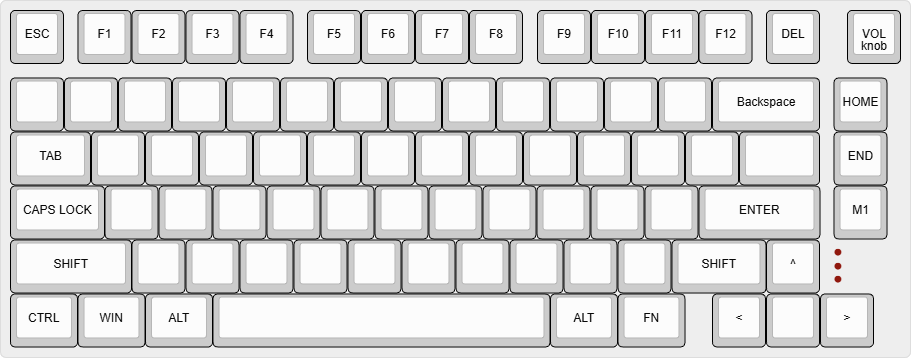

## 26 August 2026 - Specification and Layout
**Time spent: ~1 hour**

### What I did

Today I finalized the main specifications for the keyboard and created the first version of the physical layout.

I also cleaned up the GitHub repository by adding `.obsidian/` to `.gitignore`. This keeps my local Obsidian configuration out of the public repository while still allowing me to use Obsidian to write the project documentation.

### Finalized specifications

- Approximately 75% layout
    
- ANSI physical layout
    
- US QWERTY
    
- Dedicated F1–F12 keys
    
- Dedicated arrow keys
    
- Dedicated `Delete`, `Home` and `End`
    
- One programmable `M1` key
    
- Rotary encoder for volume control and mute
    
- MX 5-pin switch support
    
- Hot-swappable switches
    
- Per-key RGB using `SK6812 MINI-E` LEDs
    
- 3D-printed case
    
- Internal dampening

### Keyboard layout

I designed the physical layout using Keyboard Layout Editor. I used a conventional 75% keyboard as a starting point but removed keys I don't expect to use, such as `Page Up` and `Page Down`.

I kept `Home` and `End` because I expect them to be useful for navigating text and code. The remaining position in the navigation column became an `M1` key whose function will be decided later.

The rotary encoder is located in the top-right corner and is currently planned to control volume, with pressing the encoder muting/unmuting the computer.

This keyboard layout contains 80 MX style switches + the rotary encoder. 

**Final layout:**

The editable Keyboard Layout Editor data is stored at:

`Layout/keyboard-layout.json`

### Next steps

- Finish the BOM
- Begin work in KiCad

### Initial BOM and component sourcing

**Time spent: ~1 hour**

Continued completing the BOM.

I found candidates for:
- Stabilizers
- 1N4148 through-hole diodes
- SK6812 MINI-E RGB LEDs
- EC11 rotary encoder
- RP2040 Raspberry Pi Pico-compatible controller

I compared several RP2040 boards And ultimately landed on one with the same dimensions and pinout as a classic RP2040 Pi pico to avoid complications in the future. 

I recorded quantities, prices before checkout and purchase links in the BOM.

The remaining major parts to source include switches and keycaps as well as the dampening material, but these can wait while I design the PCB.

### Next step
- Begin work in KiCad

---

## 25.08

**Time spent: 1h**

### What I did

Started planning my keyboard and decided on the main
requirements.

### Decisions

- 75% layout
- ANSI
- US QWERTY
- MX 5-pin switches
- Kailh hot-swap sockets
- Per-key RGB using `SK6812 MINI-E`
- 3D-printed case

### Hot-swap socket research

I looked at several options and selected...

### Problems / things to investigate

- [ ] Decide mounting system

### Next steps

Finalize the exact key layout and begin the schematic.

**Repository setup - 45 min**  
Created the GitHub repository for the project and set it up as an Obsidian vault. Created the initial README and development journal, configured standard Markdown links for GitHub compatibility, and organized the repository for future PCB, CAD and image files.

---
